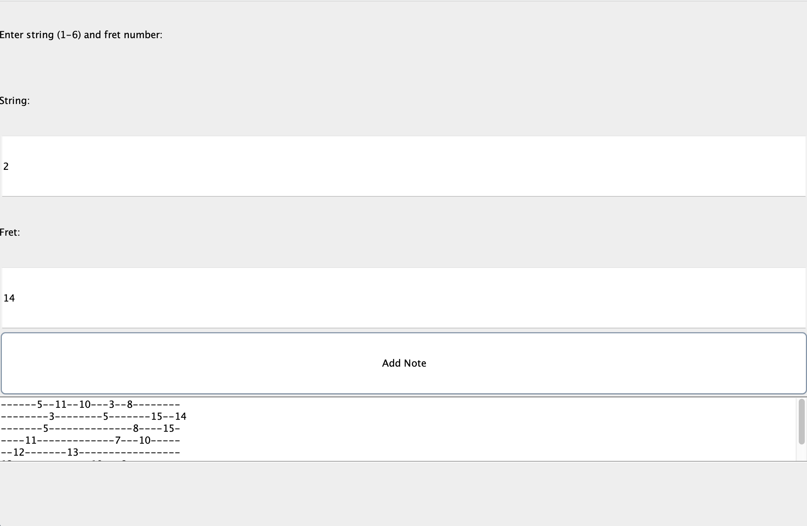

# Description
This Java application allows users to manually create guitar tabs by selecting strings and frets. It provides an intuitive interface for inputting musical notes and generating corresponding guitar tablature.

# Features
Manual Input
- Users can select strings and frets to input musical notes. The interface allows for easy entry of string numbers (1-6) and fret numbers (0-25).
Error handling is implemented to ensure valid input.
- Users will receive prompts if they enter string numbers outside the range of 1 to 6 or fret numbers outside the range of 0 to 25.

Tab Generation

- Automatically generates guitar tabs based on user input. Once the user has added notes, the application processes the inputs and displays the corresponding guitar tablature.
- The generated tabs are displayed in a user-friendly format, and the application supports multiple lines of tab for different strings.

# Tools Used
- Java Swing
- Java AWT ( Abstract Window Toolkit)


# Installation

Build and Run

```
cd guitar-tab-maker
javac Main.java
java Main
```
# User Interface

